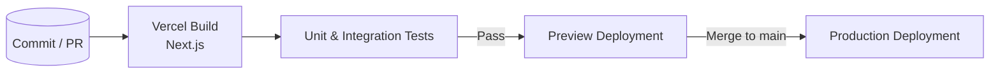

# Technical Architecture Document

## 1. Purpose
This document provides a high-level overview of the technical architecture for **Classa2**. It is intended for engineers, DevOps personnel, and stakeholders to understand the system structure, technology stack, and component interactions.

---

## 2. High-Level Architecture Diagram
```mermaid
flowchart TD
    subgraph Client
        A[Browser / Mobile Web]
    end

    subgraph Frontend[Next.js 13 (App Router) – Vercel Edge / Node]
        B[React Components]
        B -->|Firebase JS SDK| C[Firebase Auth]
        B -->|Firestore JS SDK| D[Cloud Firestore]
        B -->|Cloud Storage SDK| E[Firebase Storage]
    end

    A --> B

    subgraph Firebase[Google Cloud]
        C
        D
        E
    end
```
*Legend*
- Solid arrows: HTTPS calls.
- Sub-graphs: deployment boundaries (Vercel / Firebase).

---

## 3. Server-Side Components
| Component | Technology | Responsibility |
|-----------|------------|----------------|
| **Next.js Runtime** | Next.js 13 on Vercel (Edge & Node) | SSR/SSG, (future) API routes, asset optimisation, auth cookie refresh. |
| **Firebase Cloud Services** | Firebase Auth, Cloud Firestore, Cloud Storage | Data persistence, authentication/authorization (JWT), file uploads. |
| **Cloud Functions** *(optional)* | Firebase Functions (Node.js) | Reserved for heavy server logic, cron, SenseAI processing. |

> The project is *serverless-first*: no dedicated backend repo; heavy logic can later migrate to Functions.

---

## 4. Third-Party Integrations
| Integration | Purpose | Usage |
|-------------|---------|-------|
| Firebase Auth | User authentication | `firebase/auth` in `lib/firebaseClient.ts`; enforced by `AuthGuard`. |
| Cloud Firestore | NoSQL DB | `firebase/firestore` in `app/**`; IndexedDB offline support. |
| Firebase Storage | Asset storage | Bucket referenced via SDK. |
| Tailwind CSS | Styling | `tailwind.config.js`, `app/globals.css`. |
| React-Hook-Form & others | Forms / UI | Listed in `package.json`. |

_Future_: **SenseAI** integration for AI-assisted question selection.

---

## 5. Hosting & Deployment Details
| Layer | Provider | Environment | CI/CD |
|-------|----------|-------------|-------|
| Frontend | Vercel | Production & preview per PR | Vercel automated Next.js build. |
| Backend | Firebase | Project `edueron-a0ce0` | Managed via Firebase Console / CLI (`firebase deploy`). |
| Static Assets | Vercel Edge CDN & Firebase Storage | Global | — |

Deployment workflow:
1. Push to `main` → Vercel build & preview.
2. Successful build promotes production URL (`https://classa.vercel.app`).
3. Firebase resources provisioned once; rules updated via CLI.

---

## 6. Non-Functional Considerations
- **Scalability** – Automatic scaling on Vercel & Firebase.
- **Security** – Firestore/Storage rules; env secrets in Vercel.
- **Performance** – ISR/SSG; edge CDN; IndexedDB offline.
- **Monitoring** – Vercel Analytics & Firebase Performance.

---

## 7. Future Evolution
- Add **Firebase Cloud Functions** for heavier business logic.
- Introduce **Edge Middleware** for auth & A/B testing.
- Containerise to **AWS ECS/Fargate** if bespoke microservices emerge.

---

## 9. Detailed Data Model

A complete Entity-Relationship Diagram (ERD) will be provided. Below is a concise snapshot of the core collections:

| Collection / Table | Key Fields | Cardinality | Notes |
|--------------------|-----------|-------------|-------|
| `users` | `uid (PK)`, `display_name`, `role` | 1-n with `classes` | Stores authenticated users. |
| `classes` | `id (PK)`, `name`, `sp (bool)` | 1-n with `subjects` | School classes (grade / batch). |
| `subjects` | `id (PK)`, `name`, `classID (FK)` | 1-n with `chapters` | Subjects under a class. |
| `chapters` | `id`, `name`, `subjectID (FK)` | 1-n with `lessons` | Topic breakdown. |
| `lessons` | `id`, `title`, `chapterID (FK)` | 1-n with `questionCollection` | Individual lesson units. |
| `questionCollection` | `id`, `questionText`, `difficulty`, `lessonID (FK)` | — | Pool for assessments. |

> ERD diagram will be attached as `docs/erd.png` once completed.

---

## 10. CI/CD Workflow Diagram


---

## 11. Security & Compliance Posture
| Aspect | Current Status |
|--------|---------------|
| **Authentication** | Firebase Auth (email/password, Google OIDC). |
| **Authorization** | Firestore Security Rules V1 (least privilege). |
| **Secrets Mgmt** | Vercel env vars & Firebase config. |
| **Data Protection** | TLS in transit; AES-256 at rest. |
| **Compliance** | GDPR & COPPA friendly. |

---

## 12. Observability & Monitoring
| Layer | Tooling | Purpose |
|-------|---------|---------|
| Frontend (Vercel) | Vercel Analytics, Web Vitals | Performance metrics. |
| Client Errors | Sentry (planned), Firebase Crashlytics | Capture exceptions. |
| Backend (Firebase) | Firebase Performance Monitoring | Firestore latency, Function runtime. |
| Logging | Vercel Log Drains → BigQuery | Centralised logs. |
| Alerting | Slack + Vercel/Firebase alerts | Build failures, quota & error spikes. |

---
