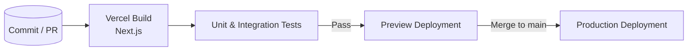

# Technical Architecture Document

## 1. Purpose
This document provides a high-level overview of the technical architecture for the **Classa2** web application. It is intended to help engineers, DevOps, and stakeholders quickly understand how the system is structured, which technologies are used, and how the different components interact.

---

## 2. High-Level Architecture Diagram
```mermaid
flowchart TD
    subgraph Client
        A[Browser / Mobile Web]
    end

    subgraph Frontend[Next.js 13 (App Router) – Vercel Edge / Node]
        B[React Components]
        B -->|Firebase JS SDK| C[Firebase Auth]
        B -->|Firestore JS SDK| D[Cloud Firestore]
        B -->|Cloud Storage SDK| E[Firebase Storage]
    end

    A --> B

    subgraph Firebase[Google Cloud]
        C
        D
        E
    end
```
*Legend*
- **Solid arrows** represent network requests over HTTPS.
- **Subgraphs** map to deployment boundaries (Vercel / Firebase).

---

## 3. Server-Side Components
| Component | Technology | Responsibility |
|-----------|------------|----------------|
| **Next.js Server Runtime** | Next.js 13 on Vercel (Edge- & Node-functions) | • Server-side rendering (SSR) / static generation (SSG) of pages<br>• API route stubs (none today, but available if needed)<br>• Asset optimisation (Image Optimization, Font Optimization)<br>• Authentication cookie refresh logic (handled client-side today) |
| **Firebase Cloud Services** | Firebase Auth, Cloud Firestore, Cloud Storage | • Persistence layer for users, classes, lessons, questions, etc.<br>• Authentication / authorization with JWT (ID Tokens & `onAuthStateChanged`)<br>• File uploads (e.g., lesson assets) |
| **(Optional) Cloud Functions** | Firebase Functions (Node.js) | • Not used in the current codebase, but reserved for future heavy server logic such as scheduled jobs, complex SenseAI processing, or secure data migrations. |

> NOTE – The project currently follows a *serverless-first* approach: there is **no dedicated backend repository**; instead, business logic either runs entirely in the browser (through Firebase SDK) or can later be off-loaded into Cloud Functions without changing the deployment topology.

---

## 4. Third-Party Integrations
| Integration | Purpose | How It Is Used |
|-------------|---------|----------------|
| **Firebase Auth** | End-user authentication (email / password, Google, etc.) | Imported via `firebase/auth` in `lib/firebaseClient.ts`; `AuthGuard` component protects pages. |
| **Cloud Firestore** | Primary document database (NoSQL) | Accessed via `firebase/firestore` throughout `app/**` for classes, questions, etc. Includes offline IndexedDB persistence. |
| **Firebase Storage** | File storage for images, PDFs, etc. | Referenced via storage bucket in the same Firebase project. |
| **Tailwind CSS** | Utility-first styling | Configured in `tailwind.config.js`; global styles in `app/globals.css`. |
| **React Hook Form / Other UI libs** | (Present in `package.json`) Form management, icons, modals. |

Future integrations (place-holders already visible in UI):
- **SenseAI** – roadmap item for AI-assisted question picking. Currently implemented client-side via Firestore queries; may later call an OpenAI/Vertex AI endpoint.

---

## 5. Hosting & Deployment Details
| Layer | Provider | Environment | CI / CD |
|-------|----------|-------------|---------|
| **Frontend** | **Vercel** – linked to GitHub repo | `production` & preview deployments on every PR | Vercel’s automated Next.js build pipeline (`npm run build && next start`). |
| **Backend Services** | **Firebase** (GCP) | Single *multi-tenant* project: `edueron-a0ce0` | Managed by Firebase Console / `firebase-tools`. Optional Cloud Functions deploy via `firebase deploy`. |
| **Static Assets** | Vercel Edge CDN & Firebase Storage | Global edge network | —— |

Deployment workflow:
1. Developer pushes to `main` → Vercel triggers build & preview.
2. On successful build, Vercel promotes to production URL (`https://classa.vercel.app` example).
3. Firebase resources are provisioned once; any schema/rules updates are applied via `firebase deploy`.

---

## 6. Non-Functional Considerations
- **Scalability** – Both Vercel and Firebase scale automatically with traffic; no server maintenance.
- **Security** – Firebase security rules protect Firestore & Storage. Runtime secrets (API keys) are stored in Vercel project env vars.
- **Performance** – Next.js leverages ISR/SSG; assets served from edge. IndexedDB offline persistence improves perceived latency.
- **Monitoring** – Vercel Analytics + Firebase Performance Monitoring recommended.

---

## 7. Future Evolution
- Introduce **Firebase Cloud Functions** for complex business logic and scheduled tasks.
- Add **Edge Config / Middleware** for advanced auth & AB testing.
- Containerise and deploy to **AWS ECS / Fargate** if a bespoke microservice layer becomes necessary.

---


## 9. Detailed Data Model

A complete Entity-Relationship Diagram (ERD) will be provided. Below is a concise snapshot of the core collections:

| Collection / Table | Key Fields | Cardinality | Notes |
|--------------------|-----------|-------------|-------|
| `users` | `uid (PK)`, `display_name`, `role` | 1-n with `classes` | Stores authenticated users. |
| `classes` | `id (PK)`, `name`, `sp (bool)` | 1-n with `subjects` | School classes (grade / batch). |
| `subjects` | `id (PK)`, `name`, `classID (FK)` | 1-n with `chapters` | Subjects under a class. |
| `chapters` | `id`, `name`, `subjectID (FK)` | 1-n with `lessons` | Topic breakdown. |
| `lessons` | `id`, `title`, `chapterID (FK)` | 1-n with `questionCollection` | Individual lesson units. |
| `questionCollection` | `id`, `questionText`, `difficulty`, `lessonID (FK)` | — | Pool for assessments. |

> ERD diagram will be attached as `docs/erd.png` once completed.

---

## 10. CI/CD Workflow Diagram


---

## 11. Security & Compliance Posture
| Aspect | Current Status |
|--------|---------------|
| **Authentication** | Firebase Auth with email/password & Google OIDC. |
| **Authorization** | Firestore Security Rules V1 – principle of least privilege. |
| **Secrets Management** | Vercel project env vars & Firebase config. |
| **Data Protection** | Firestore encryption at rest (AES-256) & TLS in transit. |
| **Compliance** | GDPR & COPPA friendly design. |

---

## 12. Observability & Monitoring
| Layer | Tooling | Purpose |
|-------|---------|---------|
| **Frontend (Vercel)** | Vercel Analytics, Web Vitals | Track performance metrics (TTFB, LCP, CLS). |
| **Client Errors** | Sentry (planned), Firebase Crashlytics | Capture runtime exceptions in browser. |
| **Backend (Firebase)** | Firebase Performance Monitoring | Measure Firestore latency and Cloud Function execution time. |
| **Logging** | Vercel Log Drains to BigQuery | Centralised queryable logs. |
| **Alerting** | Slack + Vercel/Firebase alerts | Notify on build failures, quota limits, or error spikes. |

---

